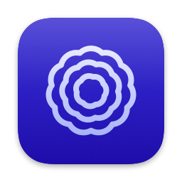

<p align="center">
  
</p>

# Wordstream

**Dictation that stays on your Mac.**

Wordstream is an open-source dictation app for macOS and an alternative to Wispr
Flow. Hold a key, talk, and your words land where your cursor is — transcribed
locally, cleaned up by whichever model you choose, with every parameter in the
open.

[](LICENSE)


- **Audio never leaves the Mac.** There is no cloud transcription path in the app at all.
- **Swap any model.** Pick your speech model, and your cleanup engine and model.
- **No account.** No sign-in, no subscription, no telemetry, no analytics, no crash reporting.

---

## Contents

- [How it works](#how-it-works)
- [Speech model](#speech-model)
- [Cleanup](#cleanup)
- [What you can change](#what-you-can-change)
- [Privacy](#privacy)
- [Install](#install)
- [Build from source](#build-from-source)
- [Permissions](#permissions)
- [Repository layout](#repository-layout)
- [Contributing](#contributing)
- [FAQ](#faq)
- [License](#license)

---

## How it works

Four steps, and you only perform the first one.

1. **Hold your key.** Right Option by default, or any key or chord you record
   yourself. Double-tap it for hands-free if you would rather not hold anything.
   Escape while recording cancels.
2. **Wordstream listens, on this Mac.** Turn on live preview and you watch the
   words arrive in the overlay as you speak.
3. **Cleanup turns speech into writing.** Filler words go, self-corrections are
   applied, punctuation and capitalisation are fixed. You choose which engine does
   it — including one that never leaves the machine.
4. **The text lands at your cursor.** Pasted with the clipboard restored
   afterwards, or written straight into the focused field. Whichever you pick, it
   works in Electron apps too.

## Speech model

Transcription runs entirely on this Mac. Nothing you dictate is uploaded.

- **A list of models, from fast to accurate.** Downloaded on demand with real
  progress rather than an indeterminate spinner. The one best suited to your
  specific Mac is pre-selected, so choosing is never a blocking step.
- **Measured, not guessed.** After a model loads, Wordstream reports how fast it
  actually runs on *your* hardware. If a model is too slow to keep up with your
  voice, the app says so instead of leaving you to wonder.

## Cleanup

Rule-based cleanup always runs. A language model on top of it removes filler
words, applies your self-corrections, and fixes punctuation — and you choose which
model, including none.

| Tier | Where it runs | What it is |
| --- | --- | --- |
| **Automatic** *(default)* | Best available | Picks the best tier this Mac can actually run right now, and falls back quietly when one becomes unavailable. |
| **Apple Intelligence** | On device | Apple's built-in on-device model. No download, no key, nothing leaves the Mac. Needs a Mac with Apple Intelligence enabled. |
| **Local model** | On device | A small model running on this Mac, with a sensible default and the option to point it at another. |
| **Cloud** | Leaves the Mac | Off unless you add an API key, which is stored in the Keychain. Anthropic or OpenAI. Only the transcribed text is sent — never the audio — and only for this step. |
| **Rules only** | On device | No language model at all. Deterministic cleanup: filler removal, spoken punctuation, spacing, capitalisation, your dictionary. |

### Style

Independent of which engine runs it. The prompt is deliberately narrow: the
failure mode for a dictation cleaner is not a clumsy rewrite, it is the model
deciding your transcript was a question and answering it.

| Style | What it does |
| --- | --- |
| Verbatim | Change as little as possible — clear errors and sentence-ending punctuation only. |
| Clean up | Drop fillers and false starts, apply self-corrections, keep your own words and tone. |
| Polished | Tighten into clear prose while preserving meaning and register. |
| Email | A short, well-punctuated email body. No greeting or sign-off you did not dictate. |
| Bullets | A concise bulleted list, one idea per bullet. |

## What you can change

Not an exhaustive list because it is a short one — an exhaustive list because
there is nothing hidden behind it.

| Setting | |
| --- | --- |
| Speech model | Trade speed for accuracy, or the other way round. |
| Spoken language | Pin a language instead of auto-detecting. Far more reliable on a two-second utterance. |
| Live preview | Stream text into the overlay while you talk. The inserted text always comes from the final pass. |
| Dictation key | Record any shortcut. Conflicts with macOS's own dictation and the emoji picker are flagged, with the fix. |
| Command mode key | A second, separate shortcut, so dictating an instruction and dictating prose need not share a trigger. |
| Insertion mode | Paste-and-restore, or write directly into the focused field. The direct path falls back to paste when an app ignores it. |
| Filler removal | Drop standalone "um", "uh", "er" — independently of whichever cleanup tier is running. |
| Spoken punctuation | Turn "period", "comma" and "new line" into the punctuation itself. |
| Custom dictionary | Map what you say to what should be written. Names, product spellings, internal jargon. |
| App awareness | The cleanup prompt shifts by target app: terse and literal in a terminal, complete sentences in a mail composer. |
| History | Every dictation kept locally, searchable, copyable, deletable. |
| Reset | Put the app back to first run — settings, history, dictionary, API keys and downloaded models, or any subset. It quits when it finishes; the three system permissions are yours to revoke in System Settings. |
| Appearance | Six palettes and a light/dark switch. |

## Privacy

Stated as a rule rather than a promise, because the code is right there.

**Never leaves your Mac**

- Your audio. There is no cloud transcription path in the app.
- Your dictation history, kept locally.
- Your custom dictionary.
- Your settings, shortcuts and palette.
- Anything at all, if you leave the Cloud tier off — which is the default.

**Only if you opt in**

- The transcribed *text*, sent to the cleanup provider you pick.
- Requires an API key you supply, stored in the macOS Keychain.
- Never the audio, and never anything else in the app.
- Model downloads.

No account, no sign-in, no telemetry, no analytics, no crash reporting service.
The app makes no network request you did not ask for.

## Install

Download the latest signed build from
[Releases](https://github.com/ParikshithV/Wordstream/releases/latest). On first
launch it walks you through the three permissions and picks a speech model for
your machine.

**Requirements:** macOS 26.3 or later, Apple silicon. The Apple Intelligence
cleanup tier additionally needs a Mac with Apple Intelligence enabled; every other
tier works without it.

## Build from source

```bash
git clone https://github.com/ParikshithV/Wordstream.git
cd Wordstream
open Wordstream.xcodeproj
```

Hit run. Swift package dependencies resolve on first build — there is no
CocoaPods, Carthage or Homebrew step. Requires Xcode 26 or later.

The app is deliberately **not sandboxed**: placing text into other apps and
noticing your dictation key from anywhere are not possible inside the App Sandbox.
That is visible in [`Wordstream.entitlements`](Wordstream.entitlements), and it
must not quietly change.

## Permissions

macOS asks for each of these separately, and each fails silently on its own, so
the app checks all three rather than assuming.

| Permission | Why |
| --- | --- |
| **Microphone** | To hear you. |
| **Accessibility** | To place text into other apps. |
| **Input Monitoring** | To notice your dictation key while another app is in front. |

## Repository layout

```
Wordstream/
├── App/              App lifecycle and the dictation state machine
├── Input/            Dictation key monitoring, shortcut recording, text insertion
├── Transcription/    Speech recognition and the model catalogue
├── Enhancement/      The cleanup pipeline and its tiers
├── Overlay/          The floating recording panel
├── UI/               Settings, onboarding, history, dictionary, menu bar
├── Models/           Preferences and the stored transcript model
├── Permissions/      The three-permission checker
├── DesignSystem/     Colour, type, spacing and shared components
├── Resources/        Bundled fonts
└── Support/          Keychain wrapper and the reset routine
```

Everything visual comes from `DesignSystem/`, and views are not allowed to reach
past it — which is why a palette switch or the dark theme never requires touching
a view.

## Contributing

Issues and pull requests are welcome at
[github.com/ParikshithV/Wordstream](https://github.com/ParikshithV/Wordstream/issues).

- Match the surrounding style. The codebase comments the *why*, not the *what* —
  read a neighbouring file before adding a new one.
- Keep the app's privacy rule intact: audio never leaves the Mac, and nothing goes
  over the network unless the user deliberately turned that tier on.
- Colour, type and spacing changes belong in `DesignSystem/`, not in the view
  that needed them.
- If a change affects what the app sends, receives, or asks permission for, say so
  in the pull request description.

## FAQ

**Does my audio ever leave the Mac?**
No. Transcription is always local — there is no cloud transcription path in the
app at all. The only thing that can be sent anywhere is the already-transcribed
text, and only if you have deliberately chosen the Cloud cleanup tier and added
your own API key.

**Why does it need three permissions?**
Microphone to hear you, Accessibility to place text into other apps, and Input
Monitoring to notice your dictation key while another app is in front. macOS asks
for each separately, and each fails silently on its own.

**Why is it not sandboxed?**
Placing text into other apps and noticing your dictation key from anywhere are not
possible inside the App Sandbox. The sandbox is deliberately, and visibly, absent
from the entitlements file.

**Does it work in VS Code, Slack, and other Electron apps?**
Yes — that is why paste-and-restore is the default insertion mode. Writing
directly into the focused field is cleaner but silently does nothing in some apps,
so it falls back to paste when that happens.

**How big is the model download?**
It depends which speech model you choose, from tens of megabytes to well over a
gigabyte. The download shows real progress rather than an indeterminate spinner,
and the app measures how fast the model actually runs on your Mac afterwards so
you can judge whether to go smaller.

**What does it cost?**
Nothing. It is MIT-licensed and there is no account, no subscription, and no
telemetry. If you turn on the optional Cloud cleanup tier, you pay your own
provider directly with your own key.

## License

MIT. See [LICENSE](LICENSE).
